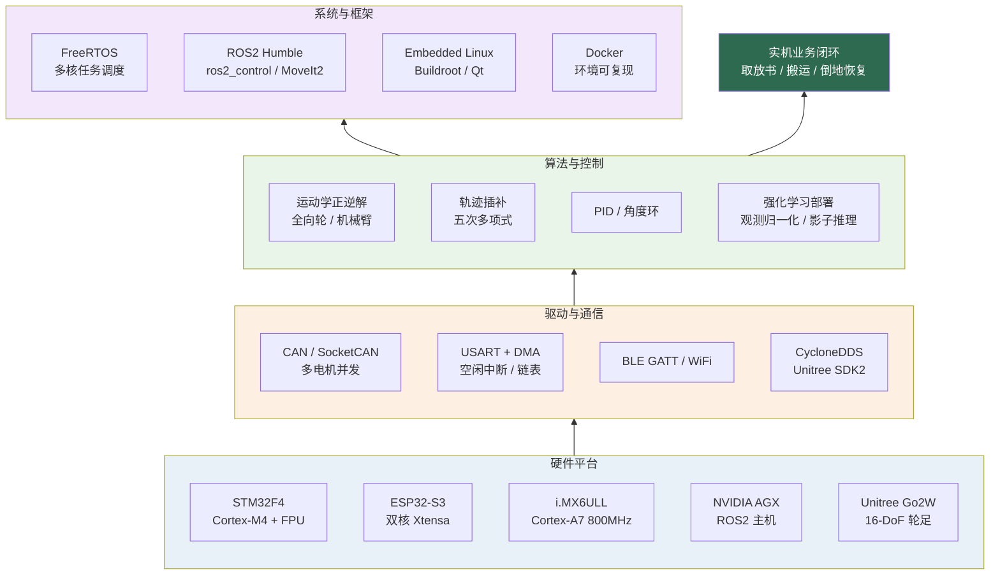

# 机器人与嵌入式系统项目集

<div align="center">

**乔天宇** · 机器人运动控制 / 嵌入式实时系统

[](https://isocpp.org/)
[](https://www.python.org/)
[](https://docs.ros.org/en/humble/)
[](https://www.freertos.org/)
[](https://www.st.com/)
[](https://www.espressif.com/)
[](https://www.linux.org/)

广东海洋大学 · 物联网工程 · 2027 届 ｜ 深圳

</div>

---

## 一句话定位

> 聚焦于**机器人实时控制链路**与**嵌入式系统**工程实现：从 CAN / 串口通信、运动学算法、RTOS 多任务，到 ROS2 / DDS 与仿真训练部署，具备把算法模型**安全、可靠地落到真机**的完整工程能力。

---

## 项目总览

| # | 项目 | 类型 | 核心技术 | 周期 |
|:--|:--|:--|:--|:--|
| 01 | [双臂轮式图书馆机器人](projects/01-dual-arm-library-robot.md) | 企业项目 | ROS2 / MoveIt2 / CAN / 力控 / 视觉 | 2026.01 – 2026.07 |
| 02 | [Go2W 轮足机器人安全恢复系统](projects/02-go2w-recovery.md) | 企业项目 | 强化学习部署 / ROS2 C++ / DDS / 故障注入 | 2026.06 – 2026.07 |
| 03 | [物流搬运复合机器人](projects/03-logistics-robot.md) | 团队项目 | 运动学 / 轨迹规划 / STM32 / 分层架构 | 2024.09 – 2025.03 |
| 04 | [智能 AI 眼镜](projects/04-ai-glasses.md) | 项目交付 | ESP32-S3 / RTC / FreeRTOS / 多核调度 | 2025.04 – 2025.07 |
| 05 | [hplayer 嵌入式播放器移植与优化](projects/05-hplayer.md) | 个人项目 | Qt / FFmpeg / Buildroot / 性能优化 | 2025.09 – 2025.11 |

---

## 技术能力全景



---

## 核心亮点

<details open>
<summary><b>⚡ 实时通信优化</b></summary>

一代双臂机器人 CAN 总线重构：批量发送 + 批量接收替代串行查询，多 CAN 盒并行调度。
**20+ 台电机单周期查询 300 ms → 4.22 ms，控制频率 3 Hz → 237 Hz**，单次通讯平均 5.62 ms，
满足 10 ms 控制周期，实机轨迹执行效率 99.5%。

详见 [项目 01](projects/01-dual-arm-library-robot.md)。
</details>

<details>
<summary><b>🦾 运动控制算法实现</b></summary>

物流搬运复合机器人：四轮全向轮速度分解（车体 / 世界双坐标系 + 角度环）、
3 自由度机械臂正逆解算、基于**五次多项式插值**的 X/Y/W 三轴轨迹平滑、
10 ms 周期路径队列推演。7 路电机协同，四层低耦合架构。

详见 [项目 03](projects/03-logistics-robot.md)。
</details>

<details>
<summary><b>🛡️ 安全关键系统设计</b></summary>

Go2W 倒地恢复：设计 **fail-closed** 安全状态机，覆盖超时 / 序号回退 / NaN /
关节余量 / 过温过流 / 急停，异常即回零作用命令并锁存故障；完成动态故障注入回归，
仿真链路 **499.898 Hz、p99 间隔 3.182 ms**；真机阶段保持**只读采集 + 无输出影子推理**，
电机输出门未打开。

详见 [项目 02](projects/02-go2w-recovery.md)。
</details>

<details>
<summary><b>🔀 多核实时任务调度</b></summary>

AI 眼镜：ESP32-S3 双核拆分——Core 0 运行采集任务（优先级 7），Core 1 运行唤醒检测
（优先级 5），解决音频环形缓冲区 `rb_out slow`；管道动态注销 / 重建 + 30 s 超时保护，
实现唤醒与对话无缝切换；硬件 8 kHz 音频实时重采样至模型要求的 16 kHz。

详见 [项目 04](projects/04-ai-glasses.md)。
</details>

<details>
<summary><b>📉 资源受限平台优化</b></summary>

hplayer 移植：i.MX6ULL 单核 800 MHz 无 GPU 平台，定位 SDL2 在 linuxfb 下窗口创建失败，
改用 QImage 纯 Qt 软件渲染；通过渲染节流至 15 fps、解码输出分辨率下调、像素格式匹配等
手段，**CPU 占用 92% → 73%~86%（典型约 73%）**，接入 VPU 硬解后进一步降低约 40%。

详见 [项目 05](projects/05-hplayer.md)。
</details>

---

## 技术栈

| 领域 | 技术 |
|:--|:--|
| **语言** | C / C++、Python、Shell |
| **机器人中间件** | ROS2 Humble、ros2_control、MoveIt2、CycloneDDS、Unitree SDK2 |
| **运动控制** | 运动学正逆解、全向轮底盘、3-DOF 机械臂、五次多项式插补、PID / 角度环 |
| **实时通信** | CAN / SocketCAN、USART + DMA + 空闲中断、BLE GATT、WiFi、自定义串口协议 |
| **MCU / RTOS** | STM32F4（FPU + ARM DSP 库）、ESP32-S3（ESP-IDF / FreeRTOS）、硬件原理图与 PCB |
| **嵌入式 Linux** | Buildroot 交叉编译、Qt 5.12、linuxfb / framebuffer、tslib、FFmpeg |
| **仿真与学习** | Isaac Lab、MuJoCo、PyTorch、PPO / 模仿学习（工程侧：环境、评估、部署） |
| **工程实践** | Docker、Git、SHA256 可复现校验、故障注入、日志与哈希管理 |

---

## 仓库结构

```text
Personal-Project-Showcase/
├── README.md                     # 项目主页（本文件）
├── LICENSE                       # 开源许可证
├── .gitignore
├── projects/                     # 项目详细文档
│   ├── 01-dual-arm-library-robot.md
│   ├── 02-go2w-recovery.md
│   ├── 03-logistics-robot.md
│   ├── 04-ai-glasses.md
│   └── 05-hplayer.md
├── assets/                       # 演示截图 / 动图
│   └── README.md                 # 素材放置说明
└── docs/
    └── DISCLAIMER.md             # 内容合规与脱敏说明
```

---

## 关于演示素材

`assets/` 目录用于存放各项目的演示截图与动图。部分素材因项目保密要求不便公开，
对应位置已在文档中标注 `<!-- 素材占位 -->`，可在面试或私聊时提供。
素材的组织与命名规范见 [assets/README.md](assets/README.md)。

---

## 联系方式

- Email：13066835916@163.com
- 求职方向：机器人运动控制 / 机器人部署工程（深圳）

---

## 说明

- 标注「企业项目」的条目为在职期间参与开发，本仓库**仅展示技术方案、系统架构与个人
 贡献**，不包含任何源码、内部资料、设备凭据或未公开数据。
- 所有技术数字均来自实际测试或项目文档，可复现、可讲解。
- 完整合规说明见 [docs/DISCLAIMER.md](docs/DISCLAIMER.md)。

---

## License

本项目文档采用 [MIT License](LICENSE)。代码与内部资料未包含在本仓库中。
