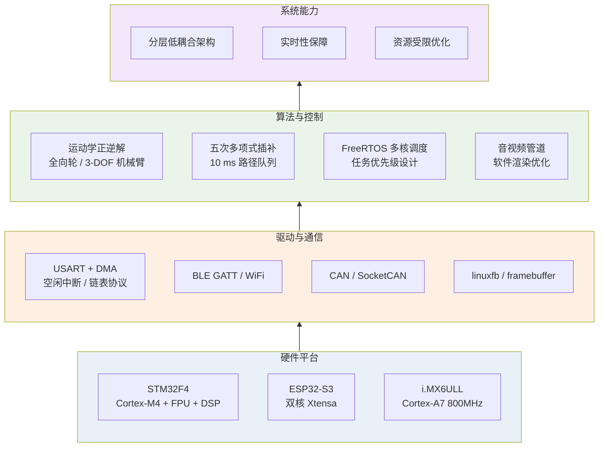

# 机器人与嵌入式系统项目集

<div align="center">

**乔天宇** · 机器人运动控制 / 嵌入式实时系统

[](https://isocpp.org/)
[](https://www.python.org/)
[](https://www.freertos.org/)
[](https://www.st.com/)
[](https://www.espressif.com/)
[](https://www.linux.org/)

广东海洋大学 · 物联网工程 · 2027 届 ｜ 深圳

</div>

---

## 一句话定位

> 聚焦于**嵌入式实时系统**与**机器人运动控制**的工程实现：从运动学算法、RTOS 多任务调度、
> 实时通信协议，到资源受限平台的性能优化，具备把控制算法**可靠地落到真实硬件**的完整能力。

---

## 项目总览

| # | 项目 | 类型 | 核心技术 | 周期 |
|:--|:--|:--|:--|:--|
| 01 | [物流搬运复合机器人](projects/01-logistics-robot.md) | 团队项目 | 运动学 / 轨迹规划 / STM32 / 分层架构 | 2024.09 – 2025.03 |
| 02 | [智能 AI 眼镜](projects/02-ai-glasses.md) | 项目交付 | ESP32-S3 / RTC / FreeRTOS / 多核调度 | 2025.04 – 2025.07 |
| 03 | [hplayer 播放器移植与优化](projects/03-hplayer.md) | 个人项目 | Qt / FFmpeg / Buildroot / 性能优化 | 2025.09 – 2025.11 |

---

## 💼 在职项目概要

以下为在职期间参与的项目。**因保密要求，本仓库不展开架构细节、源码与内部资料**，
仅列出技术关键词与可公开指标，细节可在面试中交流。

| 项目 | 技术关键词 | 可公开指标 |
|:--|:--|:--|
| **双臂轮式机器人控制系统** | CAN 总线批量收发、多设备并发调度、ROS2 Humble、MoveIt2、ros2_control、SocketCAN、视觉抓取与坐标变换 | 20+ 台电机单周期查询 **300 ms → 4.22 ms**；控制频率 **3 Hz → 237 Hz**；实机轨迹执行效率 **99.5%** |
| **Unitree Go2W 轮足机器人安全恢复系统** | 强化学习训练与部署、56 维可部署观测、fail-closed 安全状态机、CycloneDDS、动态故障注入、真机只读影子推理 | 仿真链路 **499.898 Hz**、p99 间隔 3.182 ms；真机约 **499.988 Hz** LowState 只读采集；电机输出门未打开 |

---

## 技术能力全景



---

## 核心亮点

<details open>
<summary><b>🦾 运动控制算法实现</b></summary>

物流搬运复合机器人：四轮全向轮速度分解（车体 / 世界双坐标系 + 角度环）、
3 自由度机械臂正逆解算、基于**五次多项式插值**的 X/Y/W 三轴轨迹平滑、
**10 ms 周期**路径队列推演；7 路电机协同，四层低耦合架构
（SYSTEM → HARDWARE → KINEMATICS → USER）。

详见 [项目 01](projects/01-logistics-robot.md)。
</details>

<details>
<summary><b>🔀 多核实时任务调度</b></summary>

智能 AI 眼镜：ESP32-S3 双核拆分——Core 0 运行音频采集任务（优先级 7），
Core 1 运行唤醒检测（优先级 5），解决音频环形缓冲区 `rb_out slow`；
管道**动态注销 / 重建** + 30 s 超时保护，实现唤醒与对话无缝切换；
硬件 8 kHz 音频实时重采样至模型要求的 16 kHz。

详见 [项目 02](projects/02-ai-glasses.md)。
</details>

<details>
<summary><b>📉 资源受限平台优化</b></summary>

hplayer 移植：i.MX6ULL 单核 800 MHz 无 GPU 平台，定位 SDL2 在 linuxfb 下窗口创建失败，
改用 QImage 纯 Qt 软件渲染；通过渲染节流至 15 fps、解码输出分辨率下调、像素格式匹配等手段，
**CPU 占用 92% → 73%~86%**（典型约 73%），接入 VPU 硬解后进一步降低约 40%。

详见 [项目 03](projects/03-hplayer.md)。
</details>

---

## 技术栈

| 领域 | 技术 |
|:--|:--|
| **语言** | C / C++、Python、Shell |
| **运动控制** | 运动学正逆解、全向轮底盘、3-DOF 机械臂、五次多项式插补、PID / 角度环 |
| **实时通信** | USART + DMA + 空闲中断、自定义串口协议（链表）、BLE GATT、WiFi、CAN / SocketCAN |
| **MCU / RTOS** | STM32F4（FPU + ARM DSP 库）、ESP32-S3（ESP-IDF / FreeRTOS）、硬件原理图与 PCB |
| **嵌入式 Linux** | Buildroot 交叉编译、Qt 5.12、linuxfb / framebuffer、tslib、FFmpeg |
| **机器人软件**（在职） | ROS2 Humble、ros2_control、MoveIt2、CycloneDDS |
| **工程实践** | Docker、Git、SHA256 可复现校验、故障注入、多轮性能实测 |

---

## 仓库结构

```text
Personal-Project-Showcase/
├── README.md                     # 项目主页（本文件）
├── LICENSE                       # 开源许可证
├── .gitignore
├── projects/                     # 项目详细文档
│   ├── 01-logistics-robot.md     # 物流搬运复合机器人
│   ├── 02-ai-glasses.md          # 智能 AI 眼镜
│   └── 03-hplayer.md             # hplayer 播放器移植与优化
├── assets/                       # 演示截图 / 动图
│   └── README.md                 # 素材放置说明
└── docs/
    └── DISCLAIMER.md             # 内容合规与脱敏说明
```

---

## 关于演示素材

`assets/` 目录用于存放各项目的演示截图与动图。素材的组织与命名规范见
[assets/README.md](assets/README.md)。

各项目文档中的架构图与流程图均使用 **Mermaid** 编写，GitHub 会原生渲染，
无需图片即可展示系统设计。

---

## 联系方式

- Email：13066835916@163.com
- 求职方向：机器人运动控制 / 机器人部署工程（深圳）

---

## 说明

- 本仓库**仅包含可公开的个人与团队项目文档**，企业项目的架构细节与源码不予公开，
  仅在「在职项目概要」中列出技术关键词与可公开指标。
- 所有技术数字均来自实际测试或项目文档，可复现、可讲解；
  涉及多团队贡献的指标均已标注归属。
- 完整合规说明见 [docs/DISCLAIMER.md](docs/DISCLAIMER.md)。

---

## License

本项目文档采用 [MIT License](LICENSE)。代码与内部资料未包含在本仓库中。
