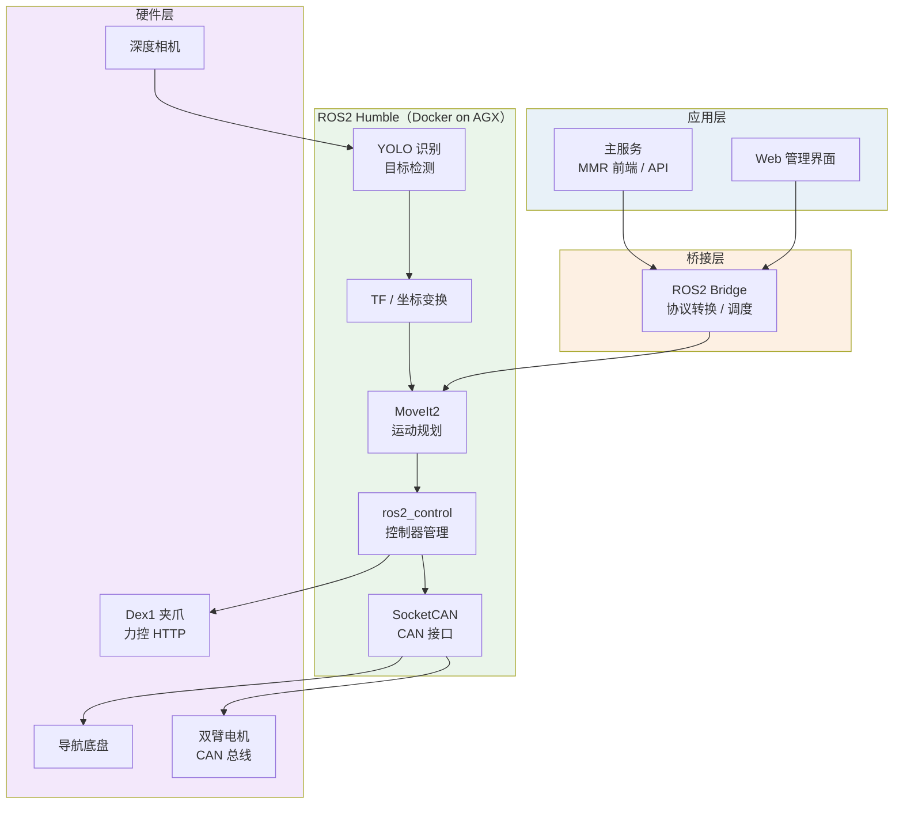
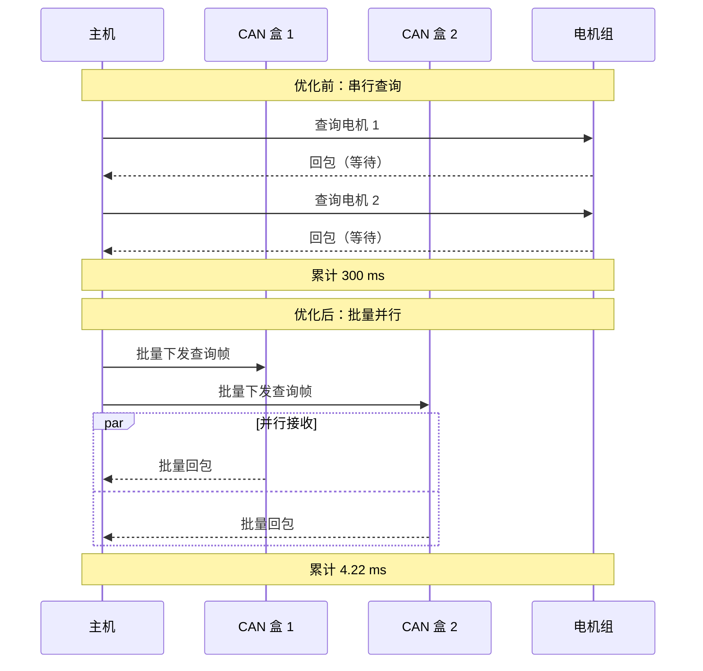

# 01 · 双臂轮式图书馆机器人

> **类型**：企业项目 ｜ **角色**：算法实习生（机器人控制向） ｜ **周期**：2026.01 – 2026.07
> **场景**：面向图书馆商用服务场景的双臂轮式机器人，集成机械臂与移动导航底盘，
> 采用分层控制架构，实现实时运动控制与多关节协同作业。

---

## 项目亮点

| 指标 | 优化前 | 优化后 |
|:--|:--|:--|
| 20+ 台电机单周期查询耗时 | 300 ms | **4.22 ms** |
| 控制频率 | 3 Hz | **237 Hz** |
| 单次通讯平均耗时 | — | 5.62 ms（满足 10 ms 控制周期） |
| 实机轨迹执行效率 | — | **99.5%** |

---

## 系统架构



**两条核心链路**

```text
控制链路：主服务 → ROS2 Bridge → MoveIt2 / ros2_control → SocketCAN → 电机
视觉链路：相机 → YOLO 识别 → 深度测距 → TF 转换 → 目标位姿 → 抓取
```

---

## 我的贡献

### 1. 一代机器人 CAN 总线通讯协议重构

**问题**：原方案为串行查询——逐台电机发送查询帧并等待回包，
20+ 台电机单周期耗时 300 ms，控制频率仅 3 Hz，无法满足实时控制需求。

**方案**：

- 设计**批量发送 + 批量接收**机制替代串行查询：一个周期内下发全部查询帧，
  再统一接收，把等待时间从 `N × 单台往返` 压缩为 `1 次往返`。
- 实现**多 CAN 盒并行收发**与多设备并发调度。



**结果**：单周期查询 300 ms → **4.22 ms**，控制频率 3 Hz → **237 Hz**，
单次通讯平均耗时 5.62 ms，满足 10 ms 控制周期要求。

---

### 2. 二代机器人 ROS2 控制栈迁移与硬件适配

- 在 **NVIDIA AGX** 上搭建 **Docker 化 ROS2 Humble** 环境，保证环境可复现。
- 完成 **MoveIt2、ros2_control、SocketCAN、YOLO 识别与底盘中间件**接入。
- 在**保留一代 MMR 前端 / API 不变**的前提下，打通
  `主服务 → ROS2 Bridge → MoveIt2 / ros2_control → CAN → 电机` 全链路。
- 打通视觉识别、深度测距、TF 转换到目标位姿生成的完整链路。

---

### 3. 取放书全流程实机联调

- 修复**相机外参与 TF 链路**，完成**像素坐标 → 基座坐标**转换。
- 适配 **Dex1 夹爪力控 HTTP 接口**，实现抓取力控。
- 实现右臂**手动示教与点位保存**能力。
- 建立 Docker ROS、宿主机夹爪、YOLO / 前端服务的**标准化启动与健康检查流程**。

**结果**：支撑二代样机从**硬件点动**到**取放书业务闭环**的实机验证。

---

## 技术栈

```text
中间件    ROS2 Humble、ros2_control、MoveIt2
通信      CAN / SocketCAN、HTTP（夹爪力控）
视觉      YOLO、深度测距、TF 坐标变换
平台      NVIDIA AGX、Docker
语言      C++、Python
```

---

<!-- 素材占位：


-->

---

## 说明

本项目为在职期间参与开发，本文档仅展示系统架构、技术方案与个人贡献，
**不包含任何源码、内部资料或设备凭据**。指标均来自实机测试。
