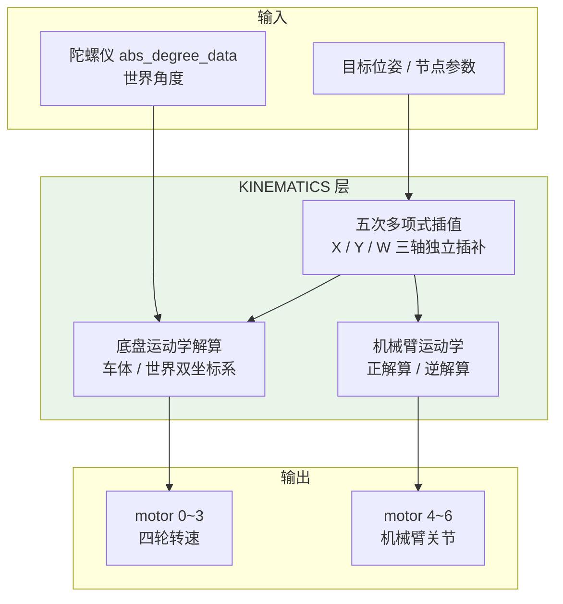
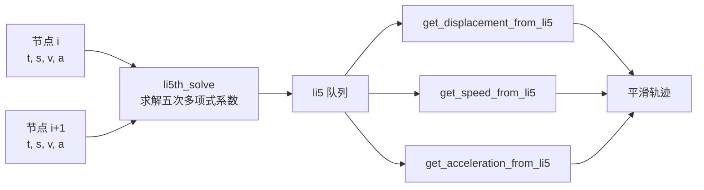
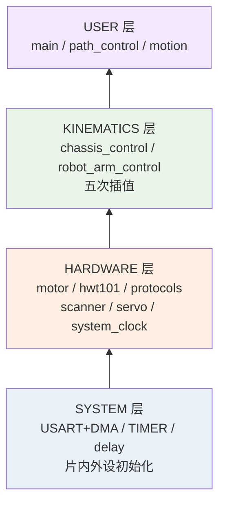
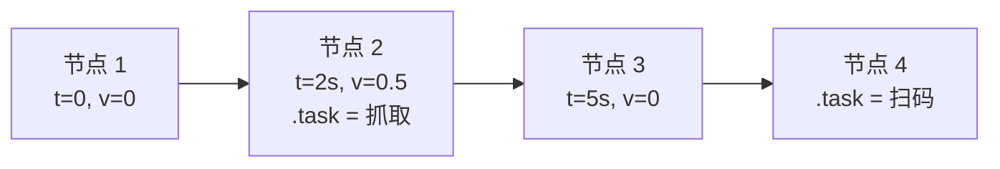
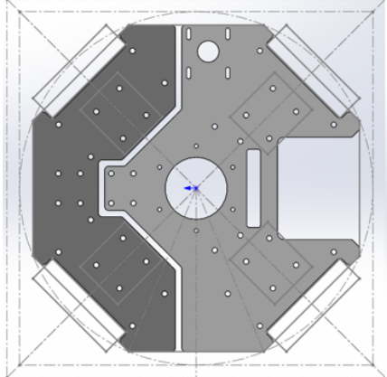
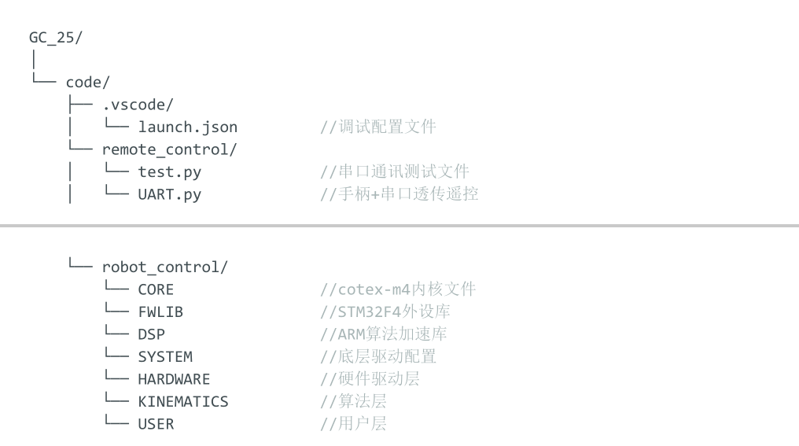
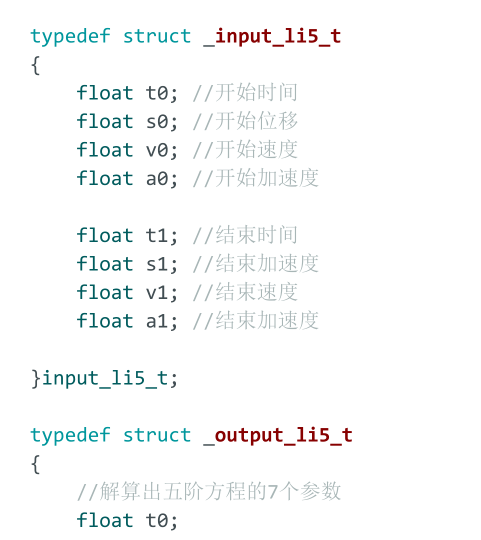
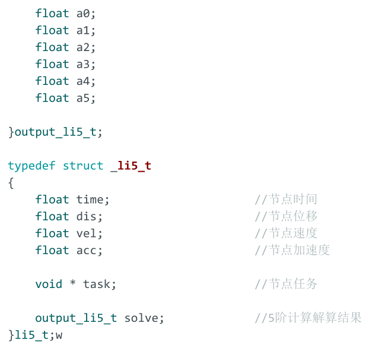
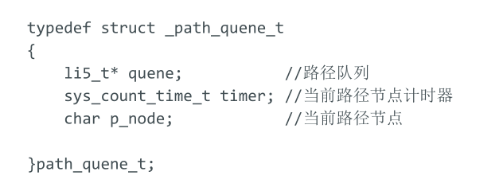
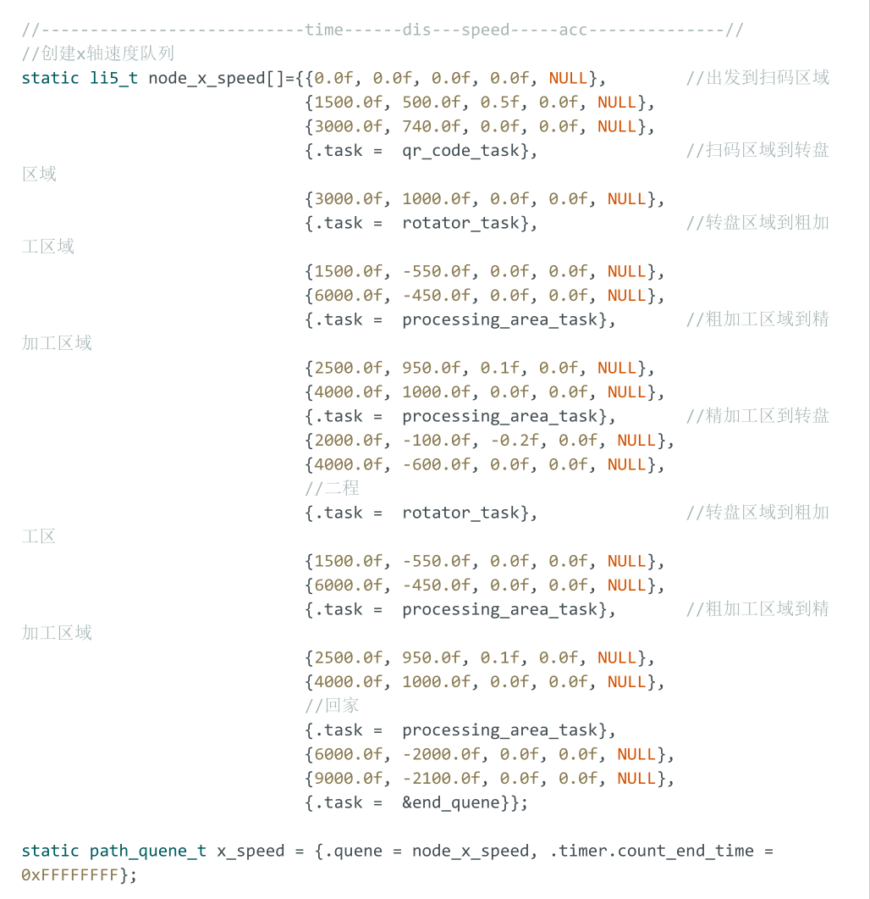

# 01 · 物流搬运复合机器人

> **类型**：团队项目 ｜ **角色**：嵌入式软件核心开发 ｜ **周期**：2024.09 – 2025.03
> **场景**：基于 STM32F4 开发自动化物料搬运加工复合机器人控制系统，
> 适配**全向轮底盘 + 3 自由度机械臂**，实现平滑运动控制、多模式定位与物料抓取自动化。

---

## 硬件清单

| 类别 | 规格 |
|:--|:--|
| MCU | STM32F4（Cortex-M4，开启 **FPU** + **ARM DSP 库**加速 sin/cos） |
| 底盘 | 四轮**全向轮** O 形布局（兼容麦克纳姆轮） |
| 机械臂 | **3 自由度**：底座旋转（xy 平面）+ 大臂 + 小臂（yz 平面） |
| 电机 | **7 路**：motor[0~3] 底盘，[4] 小臂，[5] 云台底座，[6] 大臂 |
| 陀螺仪 | HWT101（世界坐标角度 + 加速度） |
| 通信 | **6 路 USART**（usart1/usart6 开启 DMA 接收 + 空闲中断） |
| 其他 | 扫码模块、舵机、视觉模块 |

**串口分配**

| 串口 | 用途 | DMA |
|:--|:--|:--|
| USART1 | 视觉模块 | ✅ rx_dma |
| USART2 | 调试信息（重定向 printf） | — |
| USART3 | 机械臂电机 | — |
| USART4 | 底盘电机 | — |
| USART5 | 扫码模块 | — |
| USART6 | 陀螺仪 | ✅ rx_dma |

---

## 运动算法



### 1. 底盘控制：全向轮速度分解

三个速度矢量 `x`（前后）、`y`（左右）、`w`（角速度）分解为四个全向轮转速。

**车体坐标系下的解算**：

```c
motor[0].speed = -x + y - w;
motor[1].speed = -x + y + w;
motor[2].speed =  x + y - w;
motor[3].speed =  x + y + w;
```

**世界坐标系版本**（`chassis_control_Omni_Wheel`）额外包含：

- 陀螺仪角度环控制
- 世界坐标系 → 车体坐标系的**旋转矩阵**转换
- 全向轮转速转换

> 模块 `chassis_control.c` 同时兼容麦克纳姆轮与全向轮。

### 2. 机械臂控制：正解算 + 逆解算

- **正解算**（`robot_arm_calculate_forward`）：由各关节角度推算末端坐标，
  用于机械臂示教（校赛阶段未实现）。思路是已知臂长与角度，通过三角函数
  逐段累加各段 x / y 位移得到末端坐标。
- **逆解算**（`robot_arm_calculate_inverse`）：由末端坐标反推关节角度，用于**控制**。

**工程降维设计**：

```text
不在完整 3D 空间求解，而是：
  yz 平面  → 解算大臂角 + 小臂角（平面 2R 解析解）
  xy 平面  → 底座旋转分离为独立可调变量
```

**动机**：解耦后调整一个动作只需修改单个变量，无需重解完整 3D 逆解，
大幅提升调试效率。**代价**：末端定位需要人工标定底座基准角。
这是校赛阶段「功能优先」的主动取舍。

### 3. 轨迹规划：五次多项式插值

对 **X / Y / W 三轴分别独立插补**。节点配置**时刻、位移、速度、加速度**
边界条件后，自动求解该段路径每一时刻的速度与加速度。



**为什么是五次而不是三次**：五次多项式可同时约束起点与终点的
位置、速度、加速度共 **6 个边界条件**，保证加速度连续、jerk 有界，
减少机械冲击与车轮打滑。三次只能约束位置与速度，加速度在端点会跳变。

---

## 软件架构

**四层低耦合结构**：`SYSTEM → HARDWARE → KINEMATICS → USER`



| 层 | 职责 |
|:--|:--|
| **SYSTEM** | 片内外设驱动：USART（1~6）+ DMA、TIMER、delay |
| **HARDWARE** | 硬件驱动层：电机、陀螺仪、通讯协议、扫码、舵机、系统时钟 |
| **KINEMATICS** | 运动算法：底盘控制、机械臂控制、五次插值 |
| **USER** | 业务：主程序、路径控制、动作文件、远程遥控 |

> 存在少量跨层调用（`motion.c` → `protocols.h`、`protocols.h` → `scanner_driver.h`），
> 已在文档中标注为待优化项。

---

## 关键技术

### 10 ms 系统时钟与路径队列

- `system_clock.c` 使用 **TIM5** 定时中断，系统时间戳以 **10 ms** 步进：
  每次中断 `sys_time_ms += 10`，置 `timer_10ms_flag = 1`。
- `main` 中**每 10 ms 推演一次路径**：解算该时刻 X/Y/W 三轴队列的速度；
  若推演到带任务的节点，则优先执行该节点任务。

### 节点式任务抽象

- X 方向速度等运动量以**节点数组**描述（`node_x_speed[]`）。
- 每个节点结构体带 **`.task` 成员**，可指向自定义函数 → 在该节点挂载任意任务。
- 调车时只需**添加 / 修改 / 删除节点**，无需改动其他代码。



### 串口协议：DMA + 空闲中断 + 链表

- 数据包格式：`'L'` 开头、`'E'` 结尾，**最长 20 字节**。
- 串口空闲中断触发后，`packet_scan()` 自动检索包头包尾，
  置 `package_flag = rec_finish`；读取完成后手动置回 `rec_unfinish`。
- 基于**链表操作**实现动态数据包管理，解决粘包问题。

### 浮点加速

Cortex-M4 开启 FPU（添加 `__CC_ARM`、`__TARGET_FPU_VFP`、`__FPU_PRESENT`
宏定义，通过 `__FPU_USED == 1` 确认启用），配合 **ARM DSP 库**加速 sin/cos 运算，
支撑实时三角函数计算。

---

## 技术栈

```text
MCU       STM32F4（Cortex-M4 + FPU）、标准库 + ARM DSP 库
算法      全向轮运动学、3-DOF 机械臂正逆解、五次多项式插值
通信      USART + DMA + 空闲中断、自定义串口协议（链表）
调试      Cortex-Debug、PS5 手柄远程遥控（早期）
语言      C
```

## 项目图集

<table align="center">
  <tr>
    <td align="center" width="50%">
      <br/>
      <sub><b>图 1</b> · 主控板 PCB 俯视图</sub>
    </td>
    <td align="center" width="50%">
      <br/>
      <sub><b>图 2</b> · 代码文件结构（SYSTEM → HARDWARE → KINEMATICS → USER 四层）</sub>
    </td>
  </tr>
  <tr>
    <td align="center" width="50%">
      <br/>
      <sub><b>图 3</b> · 五次插值输入节点结构体 <code>_input_li5_t</code></sub>
    </td>
    <td align="center" width="50%">
      <br/>
      <sub><b>图 4</b> · 五次插值输出与队列结构体（a0~a5 + task 指针）</sub>
    </td>
  </tr>
  <tr>
    <td align="center" width="50%">
      <br/>
      <sub><b>图 5</b> · 路径队列结构体 <code>path_queue_t</code></sub>
    </td>
    <td align="center" width="50%">
      <br/>
      <sub><b>图 6</b> · 节点任务类型与流程定义（直线 / 圆弧 / 加工区）</sub>
    </td>
  </tr>
</table>
