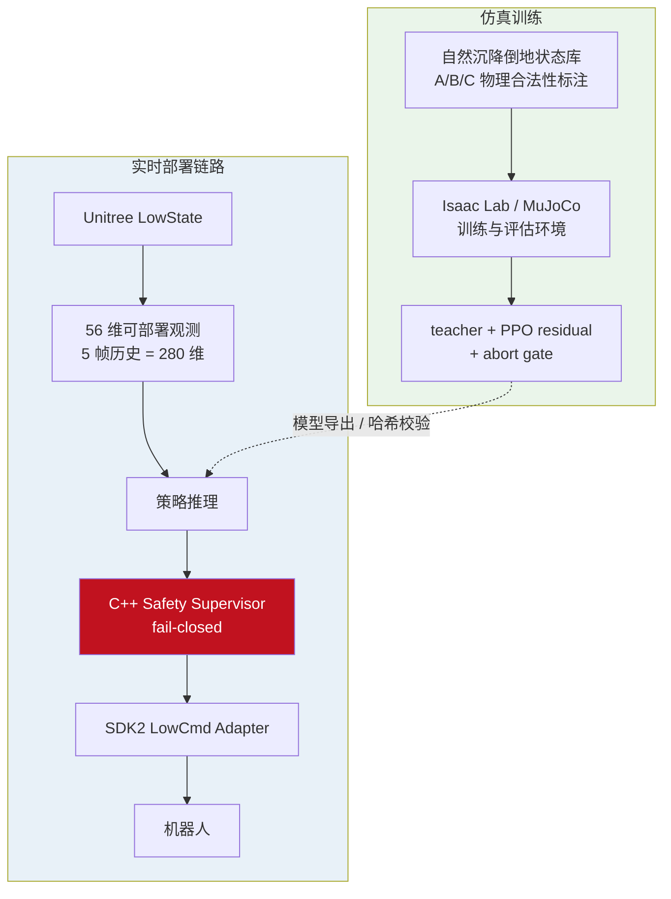
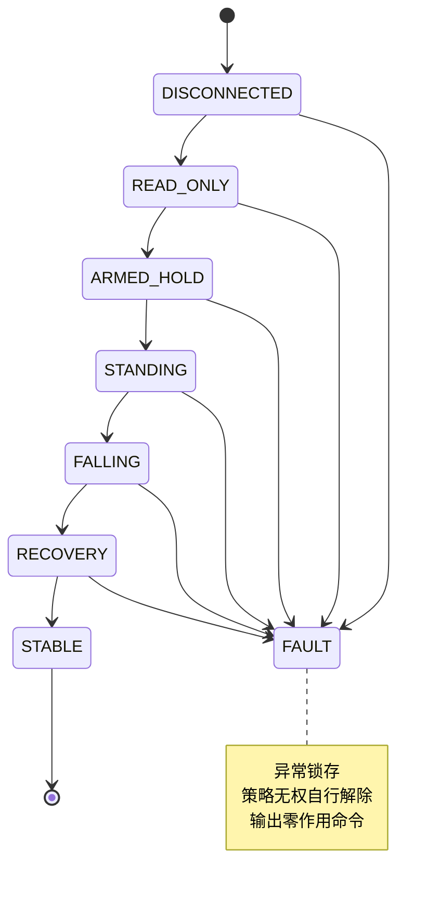

# 02 · Unitree Go2W 轮足机器人安全倒地恢复系统

> **类型**：企业项目 ｜ **角色**：训练环境与部署链路（团队协作） ｜ **周期**：2026.06 – 2026.07
> **场景**：为 16-DoF 轮足机器人倒地恢复策略构建训练评估环境与实时部署链路，
> 在**不允许真机产生任何动作**的前提下完成分级验证与安全门控。

> ⚠️ **能力边界声明**：算法策略（teacher 设计、reward、PPO 超参、DAgger 迭代策略）
> 由团队在 AI 辅助下决策。我的工作集中在**仿真环境、观测/动作接口、模型导出校验、
> 部署链路与真机只读验证**。本文档严格区分团队成果与个人贡献。

---

## 项目定位

机器人被推倒后，既要自主起身，又**不能**：

- 主动经过背部 / 顶部着地
- 让前轮大幅越过机身
- 进入硬限位或危险余量
- 靠跑出很远换取站立（工作区 3×3 m，超 4×4 m 停止）

**姿态分级**

| 类别 | 姿态 | 处理策略 |
|:--|:--|:--|
| **A 类** | belly / left_side / right_side / low_support | 允许自主恢复 |
| **B 类** | 接近背部、接近限位、姿态不确定 | 保守拒绝（abort） |
| **C 类** | back / top、前轮越身、关节卡死、状态不可信 | 强制人工救援 |

---

## 系统架构



---

## 观测与动作空间

**56 维单帧观测**（仅取真机可直接获得或可靠派生的量）

| 分量 | 维度 |
|:--|:--|
| projected gravity（IMU 投影重力） | 3 |
| gyroscope（陀螺仪） | 3 |
| 12 个腿关节位置误差 | 12 |
| 12 个腿关节速度 | 12 |
| 4 个轮速 | 4 |
| 上一周期动作 | 16 |
| 动作阶段 sin/cos | 2 |
| 路线 one-hot | 4 |
| **合计** | **56** |

- Actor 使用 **5 帧历史**：`5 × 56 = 280` 维。
- **不使用**基座高度、全局坐标、绝对航向或仿真专属接触标志——降低 Sim2Real 观测缺口。
- 五帧历史用于表达运动方向与接触演化，在不依赖仿真接触标志的前提下推断动态趋势。

**16 维动作**：12 维腿关节位置目标 + 4 维轮速目标。
动作进入机器人前需经过软限位、变化率限制、supervisor 状态机与 watchdog。

---

## 安全设计（fail-closed）



**检查项**：状态/命令超时、DDS 序号回退、NaN/Inf、关节软限位与安全余量、
轮速与动作斜率、过温过流、Sport Mode 控制权冲突、工作区越界、急停。

**原则**：任意输入缺失、不可信或超时 → 回零作用命令并锁存故障。
不因策略「看起来还能算」而继续使用旧命令。

---

## 我的贡献

### 1. 仿真环境与观测/动作接口

- 搭建 **Isaac Lab / MuJoCo** 训练评估环境（Docker 化、依赖与模型 SHA256 校验）。
- 实现并校验 **56 维可部署观测**与 `12 腿位置 + 4 轮速` 动作接口，
  含观测归一化与模型导出校验（`N × 280` / `N × 16` 形状与数值一致性）。
- 支撑固定种子大样本回归评估。

### 2. 部署链路与真机只读验证（协助）

- 协助 **ROS2/C++ fail-closed supervisor** 与 Unitree DDS 命令链
  （硬锁 `ROS_DOMAIN_ID=1`、`ROS_LOCALHOST_ONLY=1`、`SDK2 interface=lo`，
  domain 0 或非 loopback 拒绝启动）。
- 参与动态故障注入回归与**真机 30 分钟 LowState 只读采集**
  （899,980 样本，约 499.988 Hz）、**无输出影子推理**部署
  （机载电脑无 Torch，纯 NumPy 实现，与 Torch 误差 6.33e-8）。

---

## 关键指标（严格区分归属）

> 以下为**项目 / 团队结果**，非个人产出；策略相关决策由团队在 AI 辅助下完成。

| 对象 | 指标 |
|:--|:--|
| route-specific **research teacher** | 侧躺 7667 状态：严格安全成功 **99.687%**（7643/7667），零违规 |
| 同上（域随机化 0–25 N） | 983/1000，零违规 |
| 同上（25–50 N） | 932/1000，但出现 **5 次 unsafe_back → 拒绝晋级** |
| **learned candidate**（fresh8 未见盲测） | 2528 回合：**87.54%** 安全恢复，unsafe = 0，supervisor abort 311 |
| 纯 BC（对照） | 闭环 2/200 —— 低 MSE 不等于闭环成功 |

**仿真链路实时性**（simulation-only adapter）：平均 **499.898 Hz**，p99 间隔 3.182 ms，
最大间隔 4.029 ms，序号回退 0；NaN / 命令超时 / 状态断流 / 急停均在毫秒级回零。

> ⚠️ 该 499.898 Hz 为**仿真**指标；真机阶段为约 499.988 Hz 的 **LowState 只读采集**，
> 未发布任何 LowCmd。两者不可混谈。

---

## 真机进度与硬门

**已完成**：16 电机官方顺序静态核对、有线 LowState 只读采集、真实站姿关节基线、
56 维观测与 280 维历史拼接、checkpoint / normalizer 哈希核验、no-output 影子推理、
站姿 / 深折叠 / manual reject 门。

**未执行**：真实 `rt/lowcmd`、Sport Mode 释放、悬空架单关节动作、轮子试转、
软垫自主起身、真机闭环恢复。

```text
hardware_limits_verified = false
supervised_output_enabled = false
motor_command_ready      = false
real_robot_lowcmd        = prohibited
```

---

## 技术栈

```text
仿真      Isaac Lab、MuJoCo
学习      PyTorch、RSL-RL、PPO residual、DAgger（团队决策）
中间件    ROS2 Humble、CycloneDDS、Unitree SDK2
工程      C++、Python、Docker、SHA256 可复现校验
```

<!-- 素材占位：


-->

---

## 说明

本项目为在职期间参与开发。本文档仅展示系统架构、观测/动作接口设计、
安全机制与个人贡献，**不含源码、内网信息或设备凭据**。
所有指标标注归属，未完成的验证步骤明确标注为「未执行」。
