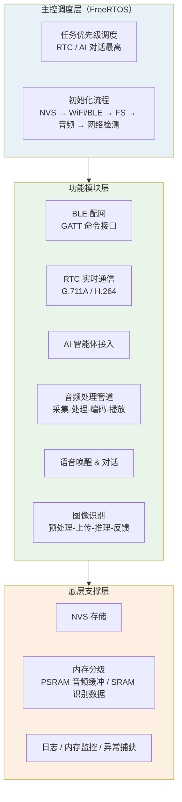
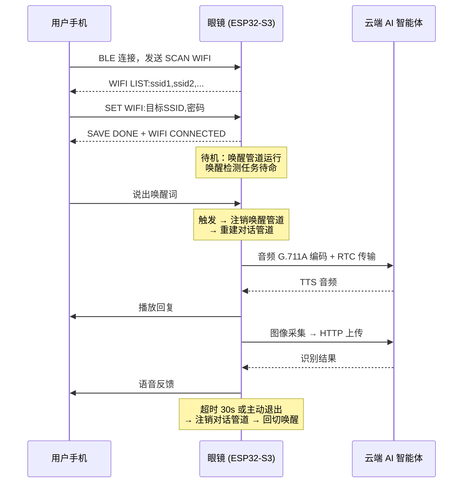
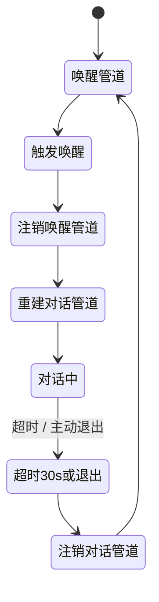

# 04 · 智能 AI 眼镜嵌入式软件系统

> **类型**：项目交付 ｜ **角色**：嵌入式软件核心开发 ｜ **周期**：2025.04 – 2025.07
> **场景**：基于 ESP32-IDF 构建智能 AI 眼镜嵌入式软件系统，实现
> 「蓝牙配网 → 语音唤醒 → AI 实时对话 → 图像智能识别」全链路。

---

## 系统架构



---

## 完整交互流程



---

## 我的贡献

### 1. RTC 实时音视频通信模块

- 集成实时通信 SDK，实现音频 **G.711A** 编码、视频 **H.264** 传输、远端音频播放。
- 支持房间接入 / 用户上下线回调。
- 通过 **WiFi / BLE 双模**通信：WiFi 作为音视频主传输通道，BLE 基于 GATT
  实现配网与设备状态同步。

### 2. 多核任务调度与 CPU 优化

**问题**：音频采集 + 编码 + 分析并行导致环形缓冲区 `rb_out slow` 报错。

**分析**：AFE（Audio Front End）环形缓冲区输出速度跟不上输入速度。

**方案**：任务拆分到**不同核心**：

| 核心 | 任务 | 优先级 | 职责 |
|:--|:--|:--|:--|
| **Core 0**（PRO CPU） | `feed_Task` | 7（高） | 音频数据采集并喂给 AFE |
| **Core 1**（APP CPU） | `detect_Task` | 5（低） | 语音唤醒检测与识别 |

采集任务优先级高于检测任务，避免检测抢占采集导致缓冲区欠载。

**结果**：`rb_out slow` 报错消除，采集与检测分离避免资源冲突。

### 3. 动态管道切换机制

**问题**：唤醒与对话功能共用音频管道，导致切换失败与卡顿。

**方案**：管道**动态注销 / 重建**：



实现要点：定义管道状态枚举 → 扩展管道结构体 → 状态管理函数 →
优化启停逻辑与任务切换 → **添加 30 s 超时保护**。

**结果**：测试切换零失败，兼顾低功耗与实时交互。

### 4. 采样率适配

**问题**：麦克风硬件采样率 **8 kHz**，AI 对话模型要求 **16 kHz**，
导致音频帧错位、识别准确率低。

**方案**：集成 `audio_resample()` 实时重采样函数，在采集后完成 8 kHz → 16 kHz
格式转换，统一输入数据格式。

### 5. BLE 配网协议

无屏设备通过手机蓝牙完成 WiFi 配置，参数保存至 **NVS** 实现上电自动重连：

| 命令 | 动作 | 返回 |
|:--|:--|:--|
| `SCAN WIFI` | 扫描热点 | `WIFI LIST:ssid1,ssid2,...` |
| `SET WIFI:ssid,pwd` | 配置并连接 | `SAVE DONE + WIFI CONNECTED` |
| `WIFI STATUS` | 查询状态 | `WIFI CONNECTED` |
| `ERASE WIFI` | 清除配置 | `WIFI DISCONNECTED` |
| `RESTART` | 重启模块 | `MODULE RESTARTING` |

### 6. 图像识别与资源管理

- 图像预处理 → HTTP 上传 → AI 推理结果接收 → 语音反馈，联动智能体实现内容识别。
- **内存分级**：PSRAM 存放音频缓冲区，内部 SRAM 存放语音识别核心数据。

---

## 技术栈

```text
平台      ESP32-S3（ESP-IDF 5.3.1）、FreeRTOS
通信      WiFi、BLE GATT、HTTP、RTC（G.711A / H.264）
云端      AI 智能体服务
存储      NVS（参数持久化）
语言      C
```

<!-- 素材占位：


-->

---

## 说明

本项目为外包交付项目，本文档展示软件架构、关键问题与解决方案。
第三方平台私有链接、内部接口地址与交付代码未包含在本仓库中。
