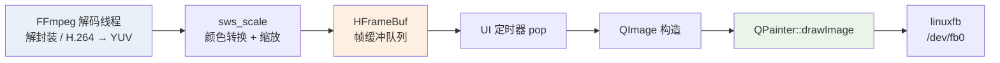

# 05 · hplayer 嵌入式播放器移植与优化

> **类型**：个人项目 ｜ **角色**：独立开发 ｜ **周期**：2025.09 – 2025.11
> **场景**：将开源 Qt + FFmpeg 播放器 hplayer 移植到 **NXP i.MX6ULL**（无 GPU、
> 无窗口系统）平台，并做全链路性能优化。

---

## 目标平台

| 项目 | 规格 |
|:--|:--|
| CPU | ARM Cortex-A7 **单核 800 MHz** |
| 内存 | 512 MB |
| 显示 | 1024 × 600 |
| 系统 | Linux（Qt linuxfb，**无 X11 / Wayland**） |
| 瓶颈 | 无 GPU 加速，纯软件渲染 |

> 核心难点不是「能不能编译过」，而是**在没有 GPU 窗口系统的前提下把视频稳定播出来，
> 并把 CPU 压到可用范围**。

---

## 运行时架构



**三段流水线**：解码线程（FFmpeg） → 帧缓冲队列（HFrameBuf） → UI 线程渲染（QImageWnd）

> 优点：解码与渲染解耦。
> 代价：队列中存在 memcpy 开销（后续优化方向之一）。

---

## 关键问题与解决方案

### 1. SDL2 在 linuxfb 下无法嵌入 Qt 窗口

| | |
|:--|:--|
| **现象** | `SDL_CreateWindowFrom((void*)winId())` 返回 `Invalid window`，程序直接退出 |
| **原因** | linuxfb 没有标准桌面窗口系统语义，SDL2 的窗口嵌入路径在该平台不可用 |
| **处理** | 新增 **QImageWnd**（QPainter + QImage），改用 Qt 直接软件渲染；ARM 构建默认切到 QImage 路径 |
| **结果** | 程序可稳定启动与播放 |

### 2. CPU 占用过高

**基线**：单路播放 CPU 常驻 **85% ~ 92%**

**优化手段**：

| 手段 | 说明 |
|:--|:--|
| `repaint()` → `update()` | 异步合并重绘，减少无效刷新 |
| 渲染节流至 15 fps | `MIN_RENDER_INTERVAL_MS = 66` |
| 解码输出分辨率下调 | 512 × 300 |
| 像素格式改为 RGB32 | 匹配 linuxfb 常见格式，减少转换 |
| 关闭高开销视觉检测路径 | ARM 平台裁剪 |

**关键结论**：

> 在本平台上，`sws_scale` 输出 1024×600 的成本很高。
> 实测 **「512×300 输出 + drawImage 拉伸」整体比「直接 1024×600 输出」更省 CPU**——
> 这是通过多轮实测才定位到的非直觉结论。

**结果**：单路 CPU 占用从 **92% 降至 73% ~ 86%**（视输入流与配置波动，典型值约 73%）；
接入 **VPU 硬件解码**后进一步降低约 **40%**。最终实现 **512×300 @ 15 fps** 流畅播放。

### 3. 触摸坐标偏移

| | |
|:--|:--|
| **现象** | evdevtouch 下越靠右下偏移越明显 |
| **处理** | 改用 **tslib** 校准，启动参数 `QT_QPA_GENERIC_PLUGINS=tslib:/dev/input/event1` |
| **结果** | 点击定位恢复正常 |

---

## 性能结果


> 该平台为单核 + 软件渲染，CPU 天花板明显，优化空间仍然集中在
> **缩放路径**与**帧拷贝**两块。

---

## 当前剩余问题

1. QPainter 软件缩放仍是主要耗时之一
2. 帧队列 push / pop 仍存在多次内存拷贝
3. 配置与编译宏不一致时，渲染器选择仍有踩坑风险

## 下一步计划

1. 继续压缩渲染路径的每帧像素处理量
2. 优化 HFrameBuf 拷贝策略，减少重复 memcpy
3. 补齐渲染器能力检查与 fallback，避免配置误选导致异常
4. 评估更底层显示路径（如直接 framebuffer）

---

## 技术栈

```text
GUI       Qt 5.12（QImageWnd / QPainter）
音视频    FFmpeg 4.x（解码 + sws_scale）
平台      NXP i.MX6ULL、linuxfb / framebuffer
工具链    Buildroot ARM 交叉编译、tslib（触摸）
网络      HTTP 拉流
语言      C++
```

<!-- 素材占位：


-->

---

## 项目总结

本质上是：在**资源受限、无桌面窗口系统**的 ARM 平台上，把桌面播放器改造成
可落地的嵌入式版本，重点解决**「能跑起来」**和**「跑得动」**两个问题。

优化过程中最有价值的经验：**不要凭直觉判断瓶颈**——
「降低解码输出分辨率 + 渲染时拉伸」比「直接输出全分辨率」更省 CPU，
这一点只有靠多轮实测才能发现。
